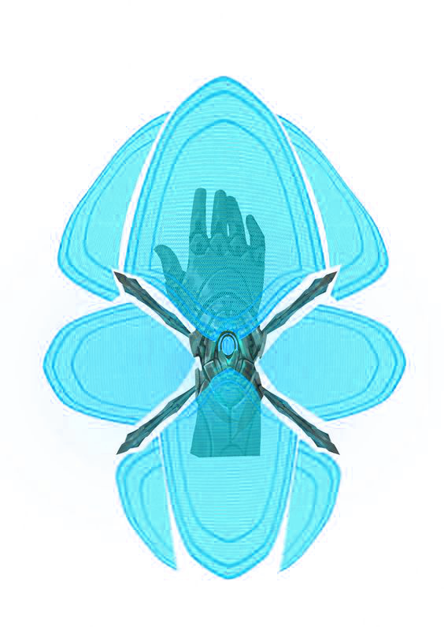

# Basic Information
**Name:** Lazuli Kleist  
**Gender:** She/her  
**Sex:** Female  
**Race:** Human  
**Age:** 20 (October 11th)  

**Height:** 5'3  
**Weight:** 120 lb  
**Build:** lean fighter, track athlete.  
**Nationality:** Atlesian  
**Aura color:** Cyan  
**Semblance color:** Cyan  
**Semblance:** Capacitance -  
Lazuli passively generates electric energy. Lazuli can use this energy to power her weapons and "charge" people. "Charge" increases the speed and durability of targets. For an object that consumes large quantities of energy, she can keep it running at full capacity for 10 minutes. For medium quantities of energy, it’s 30 minutes. For low quantities of energy, it’s 1 hour. People consume large quantities of energy. If Lazuli ever runs out of stored energy, she faints.  

# Background
**Equipment:**  

    

        </img>
    

    

        </img>
    

    

        </img>
    

    

        </img>
    

